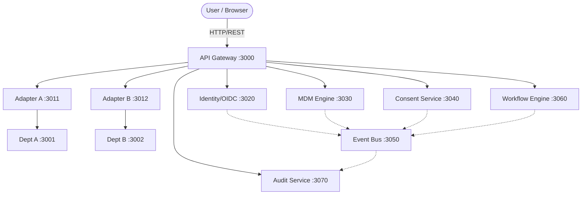

# MAHA-SETU Architecture

## System Overview
MAHA-SETU is a federated microservices platform designed for government interoperability. It acts as an integration layer enabling disparate government department systems to communicate securely and efficiently without requiring massive structural changes to existing infrastructure.

## Architecture Principles
* **Connect, Don't Replace**: Integrate existing systems via adapters rather than rebuilding them.
* **Consent-Driven**: Citizen data exchange is contingent upon explicit, revocable consent.
* **Event-Driven**: Asynchronous event streams power system notifications, audit trails, and process choreography.

## Component Landscape

* **API Gateway (Port 3000)**: Central entry point for all frontend applications. Handles routing to internal microservices.
* **Identity/OIDC (Port 3020)**: Prototype OIDC-compatible authentication service. Issues JWTs for secure access. Simulated external IdP.
* **MDM Engine (Port 3030)**: Master Data Management service. Performs fuzzy matching to create a 'Golden Record' of citizen identity across departments.
* **Consent Service (Port 3040)**: Manages citizen consent grants and revocations. Enforces consent rules before releasing sensitive data.
* **Event Bus (Port 3050)**: Central hub for asynchronous messaging. Routes domain events to interested subscribers.
* **Workflow Engine (Port 3060)**: Orchestrates long-running, cross-departmental processes (e.g., business registrations).
* **Audit Service (Port 3070)**: Immutable ledger of all significant platform activities and security exceptions.
* **Department Services**:
  * **Dept A (Port 3001)**: Simulated modern JSON API department.
  * **Dept B (Port 3002)**: Simulated legacy department.
  * **Dept C (Port 3003)**: Simulated external/third-party system.
* **Adapters**:
  * **Adapter A (Port 3011)**: JSON to Canonical schema adapter.
  * **Adapter B (Port 3012)**: XML to Canonical schema adapter.
  * **Adapter C (Port 3013)**: SOAP/Custom to Canonical schema adapter.
* **Portals**:
  * **Citizen Portal (Port 5173)**: React SPA for citizens to view records, manage consent, and track workflows.
  * **Official Dashboard (Port 5174)**: React SPA for government officials to monitor platform health, resolve identity conflicts, and manage services.

## Data Flow Diagram

## Security Model
* **Authentication**: Custom JWT generation simulating an OIDC flow. Tokens contain claims (sub, roles, iss, exp).
* **Authorization**: Role-Based Access Control (RBAC) enforced at the API Gateway and microservice level.
* **Consent Enforcement**: Data requests are verified against the Consent Service before fulfillment.

## Persistence Model
* **Database Engine**: In-memory and file-backed SQLite, implemented via `sql.js`.
* **Abstraction**: The `shared/db.js` wrapper mimics the `better-sqlite3` synchronous API to allow seamless data access across microservices within this prototype architecture.

## Event Architecture
The platform relies heavily on an asynchronous event-driven pattern for decoupling services. Key lifecycle events (e.g., `CONSENT_GRANTED`, `WORKFLOW_ADVANCED`) are published to the Event Bus, which fans them out to registered webhooks (such as the Audit Service).

## Prototype Disclaimer
This implementation is a functional prototype built for the SIH 26129 problem statement. 
* It uses a simulated OIDC pattern rather than integrating with an actual national identity provider.
* Persistent storage uses SQLite (`sql.js`) for demonstration portability.
* Department services and external IdPs are simulated representations.
