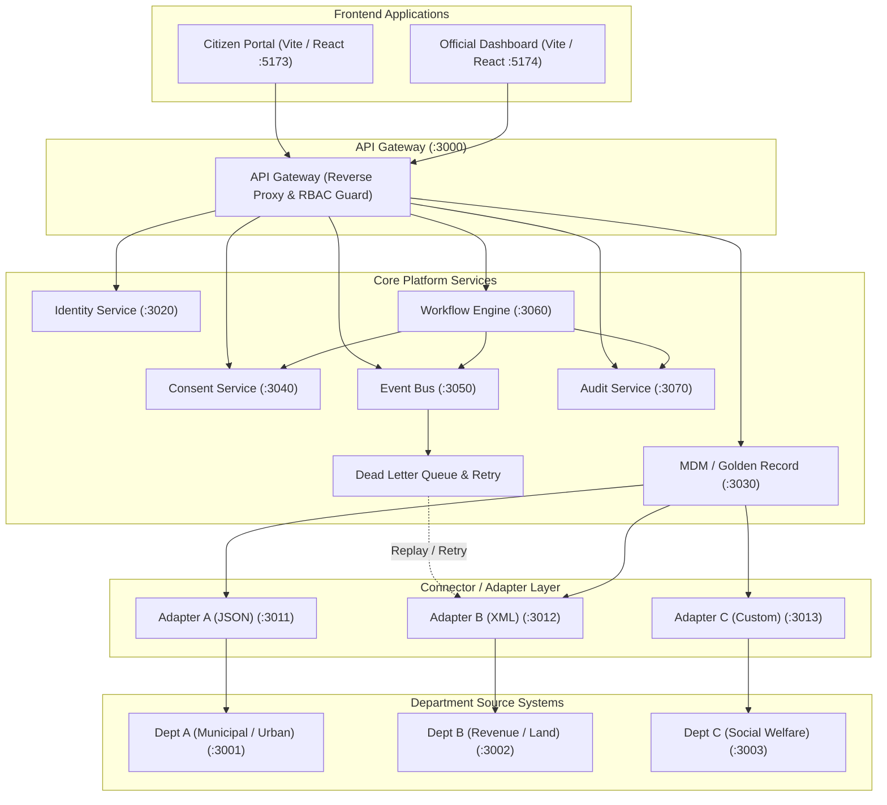

# 🏛️ MAHA-SETU

An interoperability layer that helps disconnected government systems exchange trusted data with consent, traceability, and resilient cross-department workflows.

[](docs/sih/problem-statement.md)
[](#)
[](https://nodejs.org/)
[](https://react.dev/)
[](#architecture)
[-lightgrey.svg)](#persistence)

---

### Government Digital Interoperability Platform

Government services frequently span multiple independent departments whose internal platforms use incompatible data formats, disparate identifiers, and isolated databases. Citizens are forced to repeatedly submit duplicate documentation, while officials lack cross-department verification mechanisms.

**MAHA-SETU** provides a unified interoperability layer that connects existing departmental platforms without requiring them to be rebuilt or replaced.

> **Core Principles:**
> **Verify once.** &nbsp;•&nbsp; **Share with consent.** &nbsp;•&nbsp; **Track every transition.** &nbsp;•&nbsp; **Recover from failure.**

---

## The Problem

Under Smart India Hackathon Problem Statement **26129** (*System Integration and Interoperability among Government Digital Platforms*), digital public service delivery suffers from systemic structural fragmentation:

* **Departmental Silos:** Department systems operate in isolation with independent identity registers.
* **Format Incompatibility:** Varying data formats across agencies (JSON, legacy XML, and custom schemas).
* **Identity Duplication:** Citizens hold different identifiers across departments without a unified Golden Record.
* **Absence of Consent Protocols:** Citizen data is either shared without explicit consent or blocked entirely by compliance barriers.
* **Fragile Workflows:** Multi-department approvals stall silently when downstream dependencies experience outages.
* **Opaque Audit Trails:** No unified, tamper-evident log exists to trace cross-agency access and application states.

---

## The Solution

MAHA-SETU acts as a non-invasive integration middleware connecting departments through adapters, an API gateway, master data management, and event-driven orchestration:

```
Citizen / Official
       ↓
  API Gateway (Rate Limiting, Reverse Proxy, JWT & RBAC)
       ↓
  Identity Service ── Consent Service ── MDM / Golden Record
       ↓
  Workflow Orchestration Engine ── Event Bus & Dead Letter Queue
       ↓
  Department Adapters (JSON, XML, Custom Formats)
       ↓
  Department Source Systems (A, B, C)
       ↓
  Audit Trail & Real-Time Notifications
```

> **"MAHA-SETU connects existing systems rather than replacing them."**

---

## Architecture



---

## Key Capabilities

* 🔐 **Identity & Access Control:** JWT authentication with granular role-based access (`citizen`, `dept_official`, `admin`, `system`).
* 🧬 **Master Data Management:** Deterministic and fuzzy matching across departmental records to generate unified Golden Records.
* 📜 **Consent Management:** Explicit, revocable, time-bound citizen consent enforcement prior to cross-department data sharing.
* 🔄 **Adapter Normalization:** Ingestion adapters translating heterogeneous JSON, XML, and custom schemas into IndEA-aligned canonical models.
* 🚦 **Workflow State Machine:** Multi-stage application lifecycle tracking (`SUBMITTED` → `IDENTITY_VERIFIED` → `DEPT_B_VERIFICATION` → `GRIEVANCE_CHECK` → `OFFICIAL_REVIEW` → `APPROVED` → `SERVICE_ISSUED`).
* 📡 **Event-Driven Resilience:** Asynchronous pub/sub event distribution with dead-letter queueing (DLQ) and retry capabilities during downstream service outages.
* 🛡️ **Tamper-Evident Audit:** Centralized chronological audit trail capturing actor, entity, state transitions, and consent checks.
* 💾 **Reliable State Persistence:** Pure JavaScript/WASM SQLite persistence (`sql.js`) across service restarts without external DBMS installation.

---

## Built as a Real Full-Stack Prototype

MAHA-SETU is designed and verified as a genuine database-backed prototype:

* **Starts from an Empty Database:** System startup creates fresh tables without pre-seeded business data.
* **Dynamic Lifecycle:** Citizens self-register, submit applications, grant consent, and track issuance entirely through APIs.
* **True Persistence:** SQLite files persist state across full service shutdown and restart.
* **Tested Outage Recovery:** Real simulated network failure of Department B triggers dead-letter logging, followed by live service restoration and webhook replay.
* **Simulated External Environments:** The department systems are simulated services that represent legacy systems and real-world integration patterns.

---

## End-to-End Demo Flow

1. **Citizen Registration:** Citizen creates an account and receives an authenticated JWT session.
2. **Application Submission:** Citizen initiates a multi-department service request.
3. **Identity Verification:** System confirms citizen credentials and links existing identity records.
4. **MDM Matching:** Cross-department records are queried through adapters and synthesized into a Golden Record.
5. **Consent Granting:** Citizen explicitly approves data exchange between Department A and Department B.
6. **Cross-Department Retrieval:** Department B adapter parses legacy XML data upon consent validation.
7. **Department Outage & DLQ:** If Department B goes offline, the event bus dead-letters the payload after retry limits.
8. **Recovery & Replay:** When Department B recovers, the operator triggers manual or automatic retry; the workflow proceeds.
9. **Official Review:** Department official reviews the verified canonical record and issues approval.
10. **Service Output:** Workflow reaches `SERVICE_ISSUED` and generates a verifiable output certificate.
11. **Audit Inspection:** Complete history of transitions, authorizations, and consent grants appears in the audit log.

---

## Repository Structure

```text
├── frontend/
│   ├── citizen/                 # Citizen application & consent management interface (React / Vite)
│   └── official/                # Department official review, MDM 360, & monitoring (React / Vite)
│
├── backend/
│   ├── gateway/                 # Unified reverse proxy, rate limiting, and RBAC enforcement (:3000)
│   ├── identity/                # Citizen & official authentication, password hashing, JWTs (:3020)
│   ├── mdm/                     # Master Data Management & Golden Record resolution (:3030)
│   ├── consent/                 # DEPA-compliant citizen consent management (:3040)
│   ├── workflow/                # Multi-stage cross-department workflow state machine (:3060)
│   ├── event-bus/               # Event dispatching, webhooks, and dead-letter handling (:3050)
│   ├── audit/                   # Centralized audit logging and exception tracking (:3070)
│   │
│   ├── adapters/
│   │   ├── dept-a/              # Department A JSON connector adapter (:3011)
│   │   ├── dept-b/              # Department B XML-to-JSON transformer adapter (:3012)
│   │   └── dept-c/              # Department C custom schema normalizer adapter (:3013)
│   │
│   └── departments/
│       ├── dept-a/              # Simulated Department A: Urban Development / Municipal (:3001)
│       ├── dept-b/              # Simulated Department B: Revenue & Land Registry - XML (:3002)
│       └── dept-c/              # Simulated Department C: Social Welfare - Custom Schema (:3003)
│
├── shared/                      # Common database wrapper, auth middleware, and validation utilities
├── schemas/                     # IndEA-aligned canonical JSON schemas (Citizen, Application, Grievance)
├── scripts/                     # Provisioning, database reset, and test execution scripts
├── tests/                       # Test documentation and test suite architecture
└── docs/                        # Architecture, API specifications, demo flow, and SIH documentation
```

---

## Quick Start

### 1. Prerequisites

* **Node.js**: v20.x or higher
* **npm**: v10.x or higher
* **Docker** & **Docker Compose**
* **Git**

### 2. Production Deployment (Docker + PostgreSQL + Redis)

The platform is designed to be fully containerized. To spin up the entire 17-container stack (API Gateway, 7 core microservices, 3 adapters, 3 departments, 2 frontends, PostgreSQL database, and Redis broker):

```bash
# Clone the repository
git clone https://github.com/SamarthKapdi/gov-platform-interoperability.git
cd gov-platform-interoperability

# Copy the environment file
cp .env.example .env

# Generate a strong JWT secret in .env before proceeding
# Start the stack
docker compose up --build -d

# Check health of all services
curl http://localhost:3000/health
```

### 3. Local Development (SQLite + In-Memory Event Bus)

For rapid local development without Docker, MAHA-SETU gracefully falls back to a dual-mode persistence layer using SQLite and an in-memory event bus.

```bash
npm install

# Clear any prior databases
npm run reset:empty

# Provision operational administrator and departmental official accounts
npm run provision:admin

# Launch all services locally
npm run start:all
```

### 4. Service Endpoints

| Component | URL | Description |
|---|---|---|
| **Citizen Portal** | [http://localhost:5173](http://localhost:5173) | Citizen registration, application submission, consent control |
| **Official Dashboard** | [http://localhost:5174](http://localhost:5174) | Citizen 360 search, application review, audit & metrics |
| **API Gateway** | [http://localhost:3000](http://localhost:3000) | Unified API entry point & health status (`/health`) |

---

## Verification

The platform includes two independent automated verification suites that test against fresh runtime data.

```bash
# 1. Full-Lifecycle Real Product E2E Test
npm run test:real-product

# 2. Master Self-Contained Integration Test Suite
npm run test:all
```

### What the Tests Verify:

* **PostgreSQL / SQLite Dual-Mode:** Both test suites automatically detect the active `DB_MODE` and test the respective drivers.
* **Authentication & RBAC:** Tests registration, JWT token generation, role restrictions, and negative auth rejection.
* **MDM & Golden Records:** Ingests heterogeneous department records and validates matching algorithms.
* **Consent Verification:** Confirms cross-department data exchange is rejected without active consent and granted when consent is present.
* **Workflow Progression:** Tests multi-step advancement through state machine validation rules.
* **DLQ & Outage Recovery:** Simulates Department B outage, confirms failure dead-lettering, recovers service, triggers webhook retry backoff, and asserts workflow continuation.

---

## Technology Stack

| Domain | Technologies |
|---|---|
| **Frontend** | React 18, Vite, Tailwind CSS, Lucide Icons, Recharts |
| **Backend** | Node.js, Express.js |
| **Data & Storage** | **PostgreSQL** (Production) / **SQLite** (Development Fallback) |
| **Identity & Security** | JWT (JSON Web Tokens), bcryptjs, role-based access control (RBAC) |
| **Messaging** | **Redis** (Production) / In-memory (Development Fallback) with exponential webhook backoff |
| **Data Standards** | JSON Schema (IndEA / National Data Governance Framework aligned) |
| **Containerization** | Docker, Docker Compose (Multi-stage builds) |

---

## Documentation

Comprehensive project documentation is organized in the [`docs/`](docs/) directory:

| Document | Description | Link |
|---|---|---|
| **Architecture** | System design, service responsibilities, and data flows | [docs/architecture/architecture.md](docs/architecture/architecture.md) |
| **Database Schema** | Complete schema definitions for all service databases | [docs/architecture/db-schema.md](docs/architecture/db-schema.md) |
| **API Reference** | Gateway and microservice endpoint documentation | [docs/api/api.md](docs/api/api.md) |
| **Demo Walkthrough** | Step-by-step demonstration script for evaluators | [docs/demo/demo-flow.md](docs/demo/demo-flow.md) |
| **SIH Mapping** | Detailed alignment against Problem Statement 26129 | [docs/sih/mapping.md](docs/sih/mapping.md) |
| **Problem Statement** | Original SIH problem description and deliverables | [docs/sih/problem-statement.md](docs/sih/problem-statement.md) |

---

## Engineering Notes

* **Simulated External Departments:** Departments A, B, and C are simulated integration endpoints designed to demonstrate heterogeneous formats (JSON REST, legacy XML, and custom schemas). In a live government rollout, these adapters connect to existing department servers and APIs.
* **Zero-Dependency Event Transport:** The event bus includes an in-memory pub/sub fallback for local execution without requiring a live Redis instance. A Redis connection string can be supplied via environment variables (`REDIS_URL`) when available.
* **Embedded SQLite (`sql.js`):** The prototype uses WebAssembly-based SQLite for cross-platform compatibility without native C++ compilation tools. State is flushed atomically to disk. Production deployment would transition to managed PostgreSQL/MySQL clusters.
* **Production Hardening:** Production readiness requires external secret managers, OIDC-compliant Identity Providers (e.g., Keycloak), distributed queue brokers (Kafka/RabbitMQ), and mTLS between microservices.

---

## Built for SIH 2026

* **Competition:** Smart India Hackathon 2026
* **Problem Statement:** 26129
* **Title:** *System Integration and Interoperability among Government Digital Platforms, Resulting in Fragmented Service Delivery*
* **Repository:** [https://github.com/SamarthKapdi/gov-platform-interoperability](https://github.com/SamarthKapdi/gov-platform-interoperability)
